# Day 1 – Linux Basics Challenge

## 🖥️ Starting Point
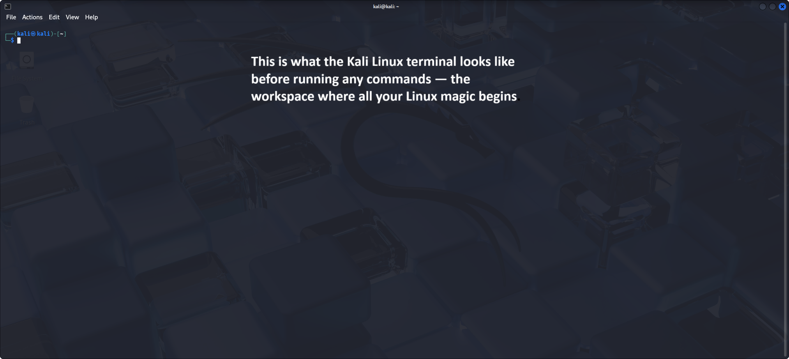

This is what the Kali terminal looks like before running any commands — a clean slate ready for action.

---
## ⚙️ Running Basic Commands & Learning Through Practice

Below are screenshots of the basic Linux commands I practiced on Day 1.  
Each image includes mini-guides I created, showing exactly what each command does and how I used them in real time.

### 🔍 Commands Covered:
- `pwd` — print working directory  
- `ls`, `ls -l`, `ls -la` — list directory contents in various formats  
- `cd` — change directory  
- `mkdir` — create a new directory  
- `echo` — display messages or output text to files  
- `cat` — view the content of files  
- `touch` — create new files  
- `nano` — open a file in the Nano text editor  

These foundational commands are essential for navigating and managing a Linux system, and this session gave me hands-on experience with all of them.

---

### 🖼️ Screenshots with Guides:

Each image below shows command outputs and mini-guides that I added directly to the screenshots for better context and explanation.

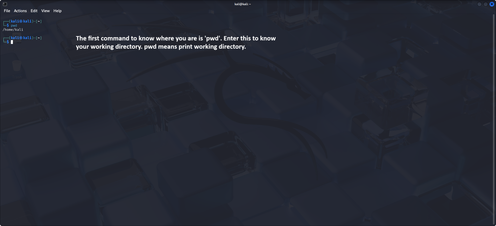  
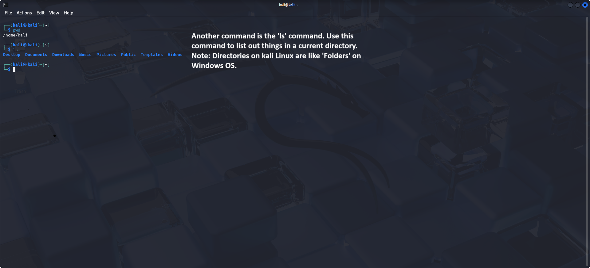  
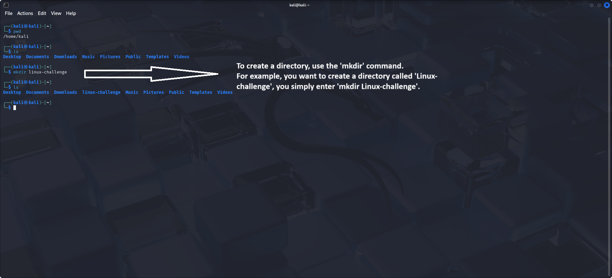  
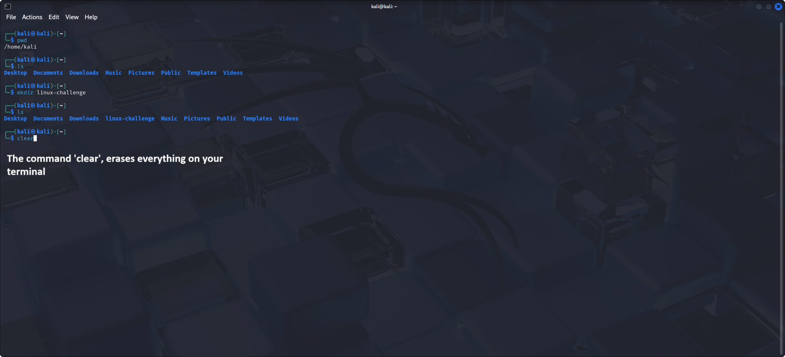  
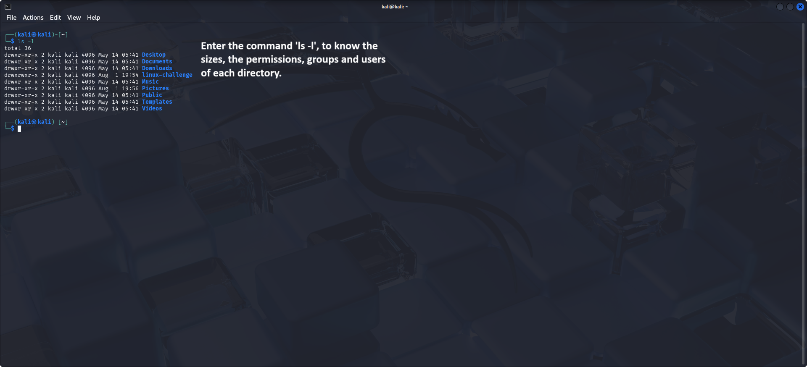  
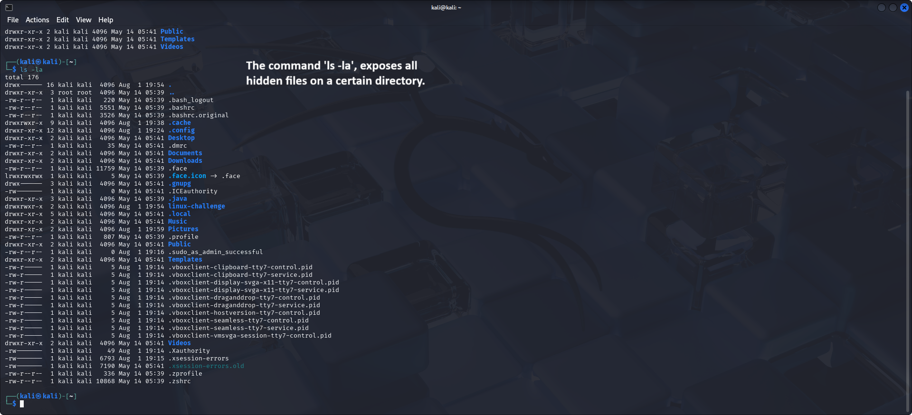  
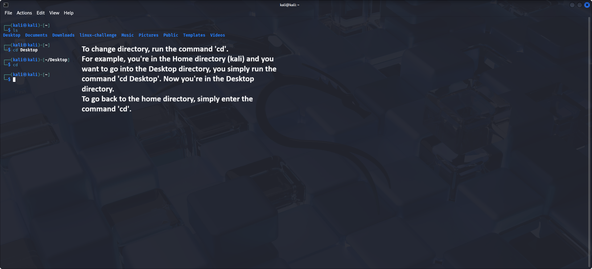  
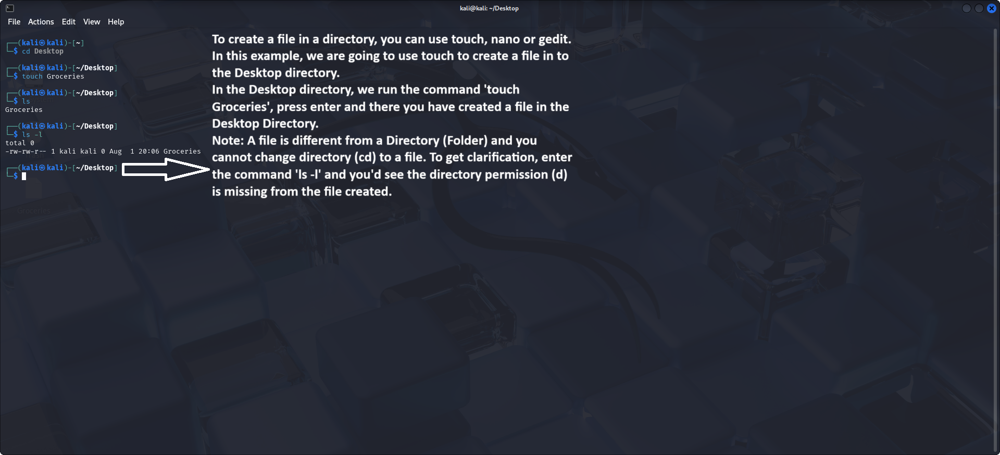  
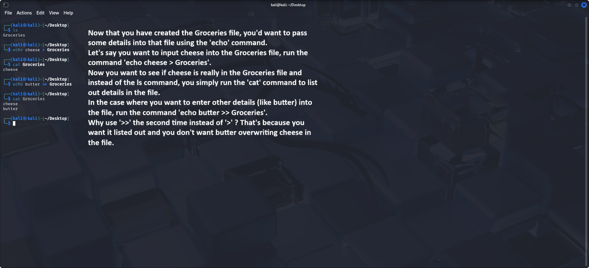  
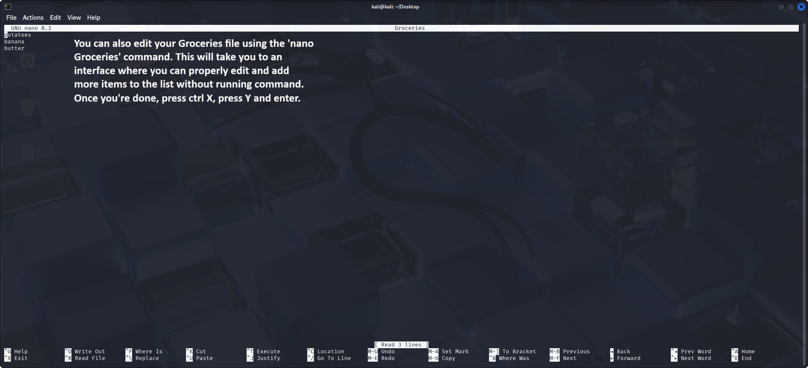

---

## 💡 Lesson Learned
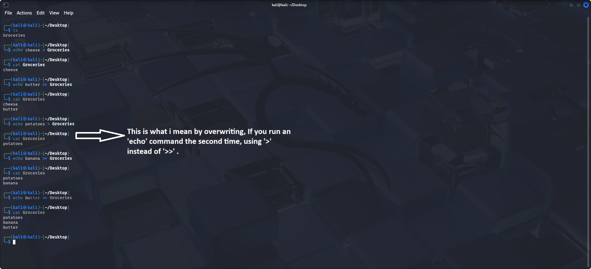
> 💡 *In the final screenshot, I made a mistake by using `>>` instead of `>` when trying to overwrite a file. This taught me the difference between the two:*
>
> - `>` — Overwrites the content of the file with new content  
> - `>>` — Appends new content to the end of the file without deleting what's already inside  
>
> I learned to double-check the redirection operator based on what I want to do: replace vs add.
