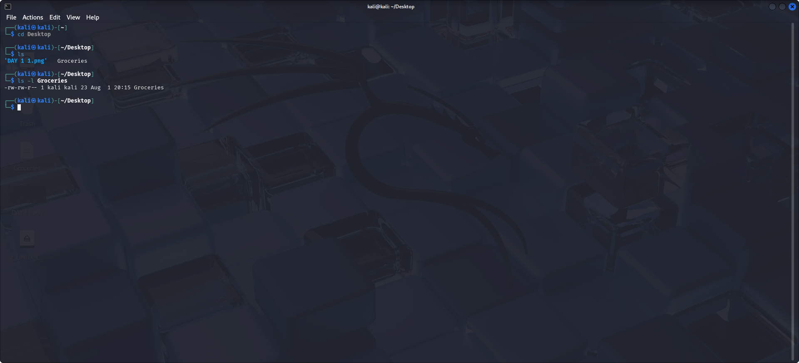
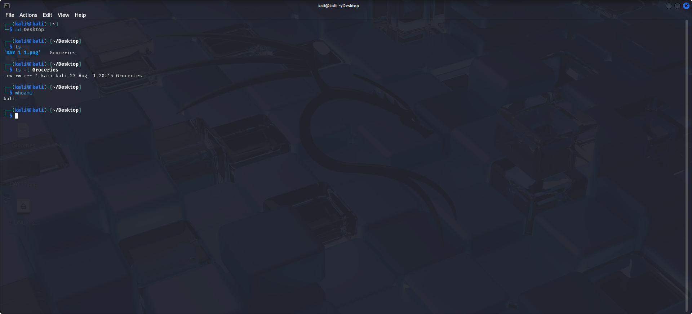
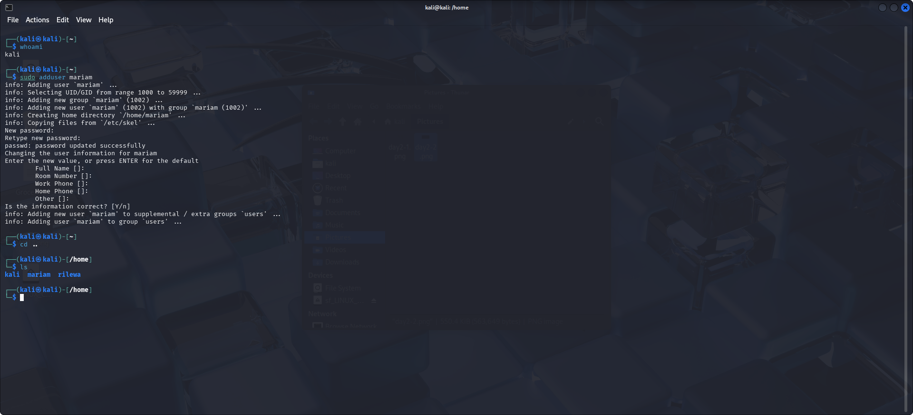
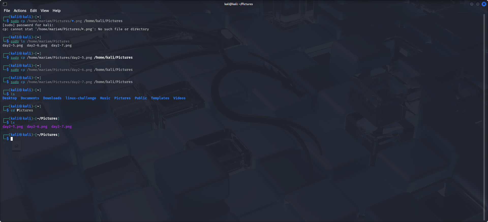

# 🛡️ Linux Challenge - Day 2: Users and Permissions

In Linux, we have three different permission classes:
- **Users/Owners (u)**
- **Groups (g)**
- **Others (o)**

All these can be represented using `a` for all users.

### 📄 Permissions include:
- **Read (r)**
- **Write (w)**
- **Execute (x)**

> Users and groups can have all three permissions (rwx), but it’s not advisable to give full permissions to others.

---

## 🔍 File Permission Overview

  
We navigated to the `Desktop` directory where our `Groceries` file from Day 1 lives. Running `ls -l Groceries` shows something like:

```
-rw-rw-r-- 1 kali kali ...
```

- **Users (kali)** → `rw-`: can read and write.
- **Groups (kali)** → `rw-`: can read and write.
- **Others** → `r--`: can only read.

---

## 👤 Who Owns the File?

  
As you can see in the file details (`kali kali`), the first `kali` is the user, and the second is the group.  
To confirm your username, run:

```bash
whoami
```

---

## ➕ Adding a New User

  
We added a new user with:

```bash
sudo adduser mariam
```

To confirm, navigate back to the home directory with `cd ..` and `ls`.

---

## 🔁 Switching Users

  
We switched users using the GUI (Power > Switch User).  
Then, we confirmed the switch with `whoami`.  
Note: the new user doesn’t have sudo permission.

---

## ✏️ Editing Permissions with chmod

  
We created a dummy file with:

```bash
touch test.txt
```

Then changed permissions like so:

```bash
chmod u+x test.txt
chmod g+x test.txt
chmod o+wx test.txt
```

---

## ⚠️ Lesson Learned

  
We took screenshots under a different user and needed to transfer them back to `kali`. We used:

```bash
sudo cp /home/mariam/Pictures/filename.png /home/kali/Pictures/
```

Be precise with spelling, extension, and path.

---
