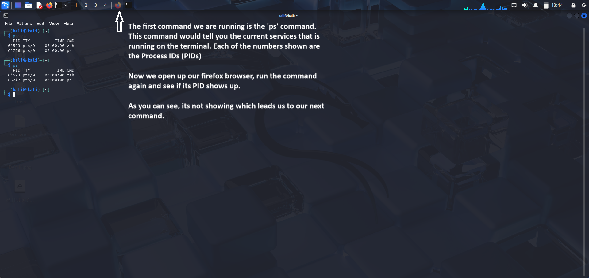
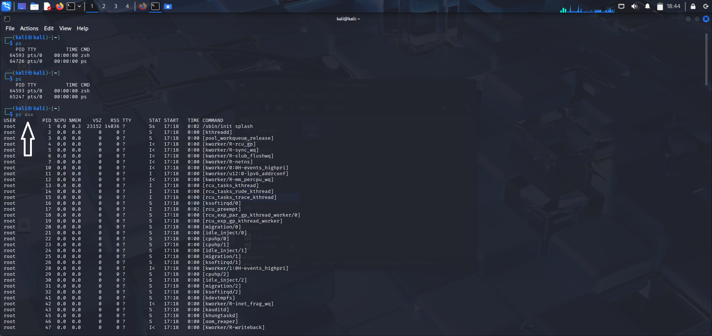
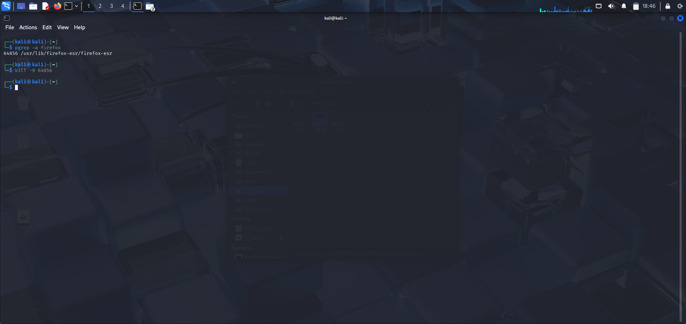
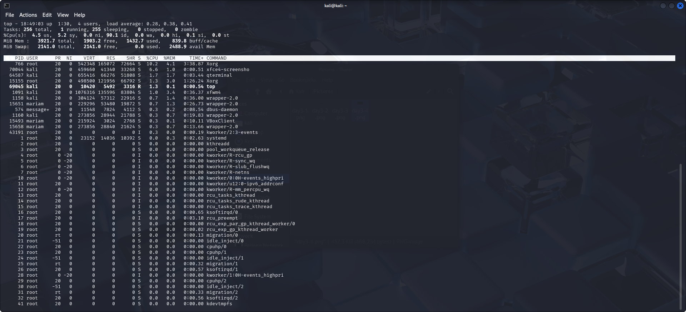
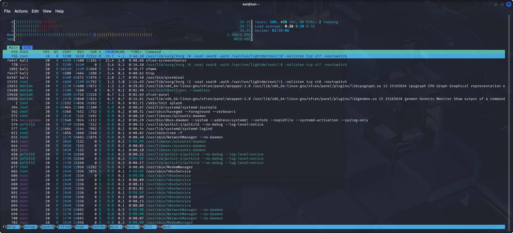
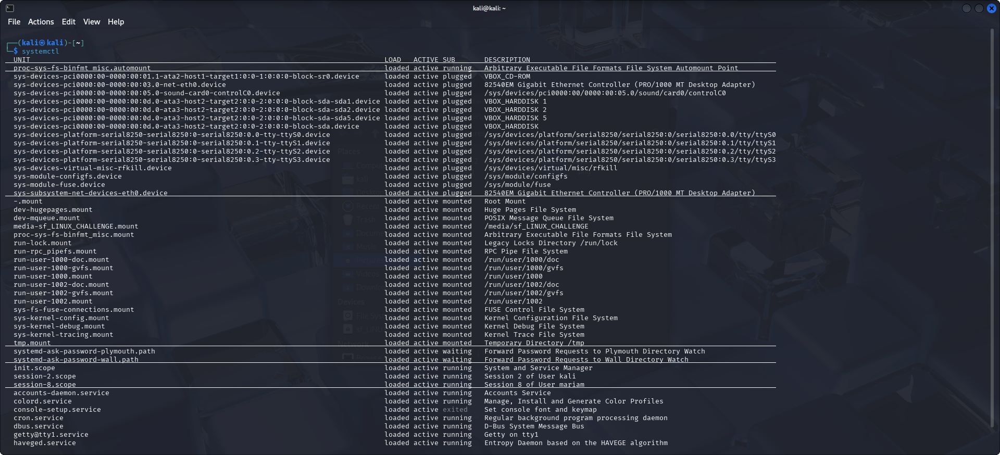
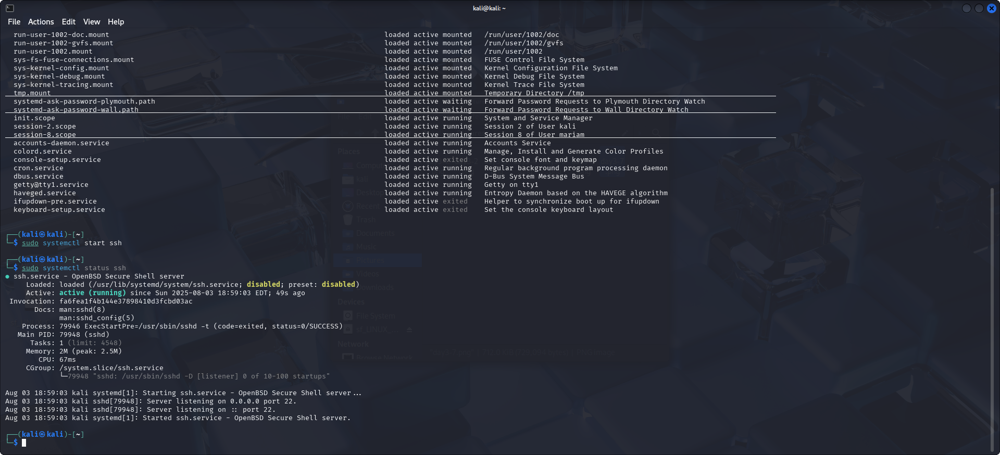
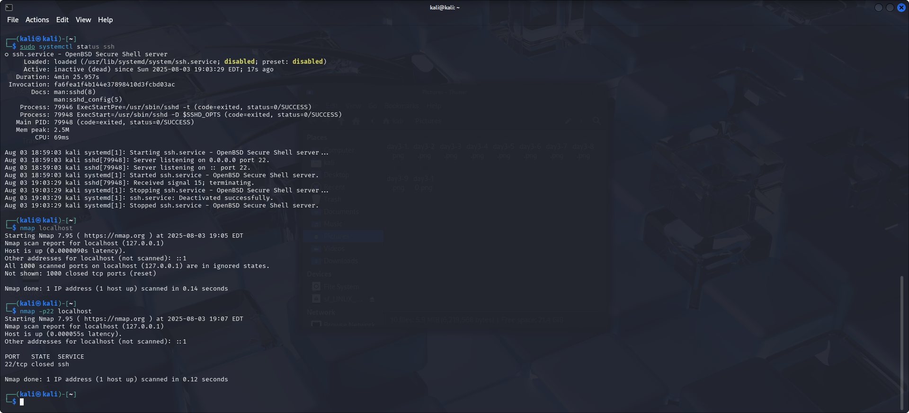

# 🧠 Day 3: Processes and Services

---

## 🧩 Understanding Processes

To view processes currently running under your user session, the `ps` command is used.

ps

This shows active processes, but the output is limited.

---

## 🔍 More Details with ps aux

To see **all** processes (system-wide), use:

ps aux

Still, Firefox didn’t show up here, so let’s try a more direct approach.

---

## 🎯 

Use `pgrep -a` to find the process ID of Firefox:

Then, to kill it:

kill -9 <PID>

> Why `-9`? It sends a SIGKILL signal that forcefully terminates the process immediately.

---

## ⚙️ Monitoring Services with top and htop

To see real-time updates of services:
top

Use `htop` (GUI-based) for better interactivity — you can kill (F9) or quit (F10) from here.

  

---

## 🧾 systemctl: Service Manager

Run:

systemctl

This shows installed and managed services on your system.

---

## 🚀 Starting a Service

Let’s start the SSH service:

sudo systemctl start ssh
sudo systemctl status ssh

You should see “active (running)” in the output.

---

## 🔎 Scanning for Open Port (SSH)

Let’s check if port 22 is open using Nmap:

nmap localhost

You’ll likely see port 22 open.

> ⚠️ **Security Tip:** Don’t leave this port open unnecessarily.

---

## 🔒 Stopping the Service & Confirming

To stop SSH:

sudo systemctl stop ssh
sudo systemctl status ssh
nmap -p22 localhost

💡 Summary & Lesson Learned

Today we learned how to:

    Monitor and kill running processes using ps, pgrep, kill

    View services dynamically with top and interactively with htop

    Start and stop system services with systemctl

    Securely manage ports using nmap

By combining these tools, we’ve taken another big step toward understanding how Linux handles internal processes and services.
