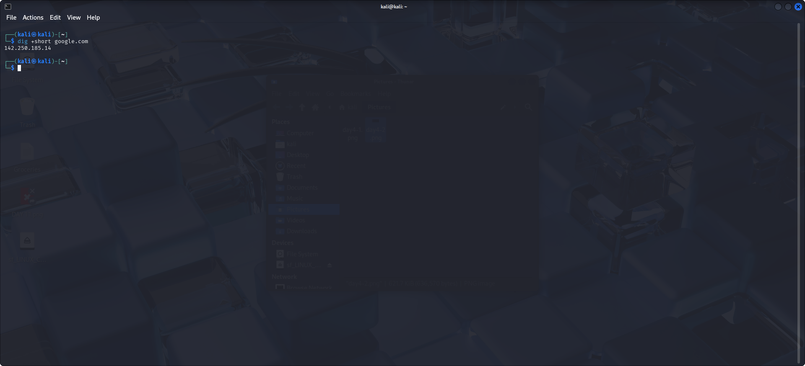

# 🧠 Day 4: Networking

## 🖼️ `day4-1.png`

To find your IP address, use the command:
```bash
ifconfig
```

To understand your subnet mask and see more interface details, use:
```bash
ip a
```

You’ll find the interface `eth0`, which shows your router’s IP address and the subnet range. This subnet can be used for ARP scanning to identify all devices connected to the network.


---

## 🖼️ `day4-2.png`

We can scan the IP addresses within our network using ARP scan.

Command:
```bash
arp-scan [IP address range]
```
If permission is denied, add `sudo`:
```bash
sudo arp-scan [IP address range]
```
This will display all the devices connected to your local router.


---

## 🖼️ `day4-3.png`

To fetch DNS information, use the `dig` command.

Command:
```bash
dig +short google.com
```
This displays the DNS (Domain Name System) records for the domain `google.com`.



---

## 🖼️ `day4-4.png`

We run a **safe** Nmap scan on ourselves (our localhost). Please never scan a domain or IP you do not have permission to scan.

Command:
```bash
nmap localhost
```

This shows that **1000 TCP ports are closed**. These are the most common ports that Nmap scans by default. If no service is actively listening on a port, it is marked as closed.

We also test network reachability using:

```bash
ping google.com
```

To avoid the ping from running endlessly, we use:
```bash
ping -c5 google.com
```


---

## 🖼️ `day4-5.png`

We trace the route your IP packets take before reaching Google using:

```bash
traceroute google.com
```

This shows each hop (up to 30 max) the packet makes from your system to the destination server. It starts from your local gateway (router) and helps identify delays or failures in the path. Look at the time stamps (`ms`) to locate any latency issues.


---

### ✅ Lesson Learned

- I learned how to use tools like `ifconfig`, `ip`, `arp-scan`, `nmap`, `ping`, and `traceroute` to analyze local network activity.
- I discovered how to scan for connected devices and trace the journey of data packets through the internet.
- Also, I reinforced the importance of not scanning unauthorized devices with Nmap for ethical and legal reasons.

