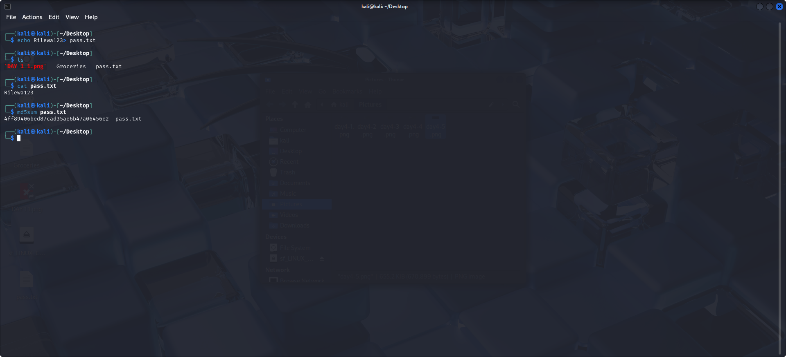
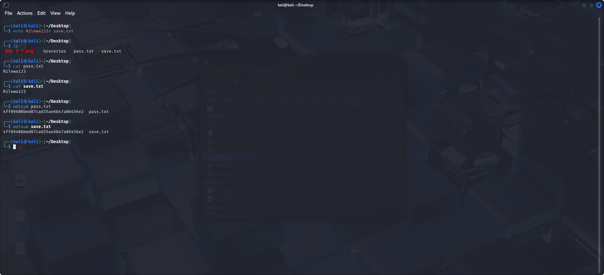
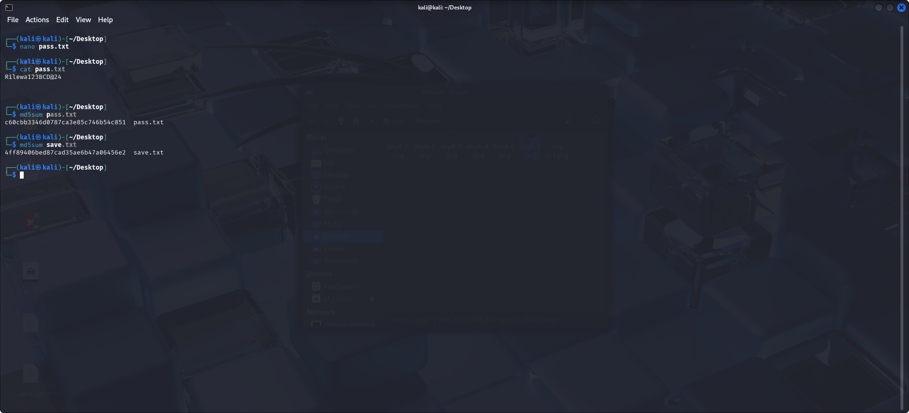

# 🔐 Day 5: Hashing & Integrity

## 💡 What is Hashing?

Hashing is the process of converting data (like a password or file content) into a fixed-size string of characters, which is typically a hash value.  
It’s commonly used in cybersecurity to ensure **data integrity**, **store passwords securely**, and **verify authenticity** of files or messages.

Hashing is a **one-way function**, meaning once data is hashed, it can't be reversed back to its original form.

---

## 🔏 Creating and Hashing a Password File

On the Desktop directory, we created a password file named `pass.txt` using:

```bash
echo Rilewa123 > pass.txt
```

- We used `ls` to list the file, and:
```bash
cat pass.txt
```
to view the content, which is our password: `Rilewa123`.

Now we hash the file using the **md5sum** algorithm:

```bash
md5sum pass.txt
```

🖼️ 

---

## ✅ Confirming Integrity of Identical Passwords

We created another file named `save.txt` and passed in the same password using:

```bash
echo Rilewa123 > save.txt
```

- Checked both files with:
```bash
cat pass.txt
cat save.txt
```

- Then hashed `save.txt`:

```bash
md5sum save.txt
```

- Both files have identical content and produce the **same hash** value.

🖼️ 

---

## 🧂 Salting the Password to Enhance Security

Even though the passwords are hashed, they can still be brute-forced using a **Rainbow Table** attack.

To prevent this, we introduce **salting**, which adds a random string to the password.

We updated `pass.txt` using:

```bash
nano pass.txt
```

Then changed the content to:

```
Rilewa123BCD@24
```

- View it using `cat pass.txt`
- Re-hash the file using:

```bash
md5sum pass.txt
```

- Now compare the new hash with that of `save.txt` — it’s **different** due to salting.

🖼️ 

---

## 🎓 Lesson Learned

- Learned how to create and hash files using the `md5sum` algorithm
- Understood how identical inputs generate identical hashes
- Explored the security weakness of unsalted hashes
- Saw how salting enhances password security by generating different hashes even for the same base password

---

## 🏁 Closing Remarks

This wraps up the 5-day Linux challenge — it was an incredibly insightful experience!  
From file navigation to permissions, processes, networking, and hashing, each day brought a new layer of Linux mastery.

✨ More projects coming soon — stay tuned!
